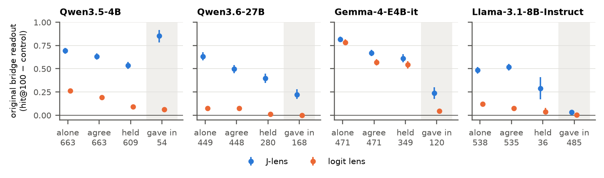

# Silent Dissent

**LLM agents that yield to the majority still represent their original premise.**

Ziang Ni (Delft University of Technology) · preprint, October 2026 ·
[paper](paper/silent_dissent.pdf) · [supplement](paper/silent_dissent_supplement.pdf)

When an LLM agent in a multi-agent debate abandons a correct answer to join a unanimous majority, has it
changed its mind, or only its statement? We read a premise the agent never states: in two-hop factual
statements ("the capital of the country where the Sagrada Familia is located is ..."), the intermediate
entity (the *bridge*, here Spain) is never written by anyone. Scripted peers, in the role of Asch's
confederates, assert a wrong answer; at the moment the agent answers, we decode the bridge from its residual
stream with the Jacobian lens (J-lens) and the logit lens.



## Findings

Pre-registered tests on held-out facts, four open-weight models (Qwen3.5-4B, Qwen3.6-27B, Gemma-4-E4B-it,
Llama-3.1-8B-Instruct); readout = hit@100 of the bridge minus a control entity, averaged over the
pre-registered layers.

- **Silent dissent.** Agents of Qwen3.5-4B, Qwen3.6-27B and Gemma that gave in still represented their
  original bridge (0.85, 0.22, 0.24), where the logit lens rarely ranked it among the top 100 tokens
  (0.00–0.06). They also represented the bridge behind the peers' answer, beyond a mention baseline.
- **Not read back from the agent's own answer.** A pre-registered addendum hid the agent's earlier answer or
  removed it: agents that gave in still represented their original bridge in all four models (0.43, 0.29,
  0.37, 0.25 with the answer hidden), including Llama-3.1-8B-Instruct, which barely did so with its answer in
  view (0.03).
- **Protocols matter.** Hiding the earlier answer changed conformity: Qwen3.5-4B gave in on 89% of questions
  instead of 8%.
- **Causal (exploratory).** Injecting the bridge's J-lens direction brought agents back to their original
  answer in the two Qwen models, not in Gemma or Llama.
- **Negative results** of the pre-registered program are reported, including a letter-answer study whose
  positive control showed that answer-position readouts were blind.

Every number in the paper comes from [`docs/results/crossmodel_summary.json`](docs/results/crossmodel_summary.json).

## Repository

| Path | Contents |
|---|---|
| `silent_dissent/` | library: prompts and conditions, logit lens and Jacobian lens (with a port of the reference estimator), readouts, injection, metrics |
| `scripts/` | one command-line script per step: fact check and split, development runs, selection and registration, test runs, timeline, injection, free debate, analysis, cross-model summary, figures and tables |
| `configs/` | configuration of every model and lens refit |
| `prereg/` | all pre-registration files, byte-identical to the committed versions ([PREREGISTRATION.md](PREREGISTRATION.md)) |
| `tests/` | unit tests and an end-to-end run of the pipeline on a small random model (no downloads) |
| `docs/results/` | cross-model summary, robustness, addendum and free-debate summaries, figures and supplementary tables |
| `paper/` | the paper and its supplement (PDF) |

## Install and test

```bash
pip install -e ".[dev]"
pytest -q
```

## Reproduce the figures and tables (CPU, seconds)

```bash
python scripts/entity_paper.py        # figures and main tables from docs/results/crossmodel_summary.json
python scripts/entity_supp_tables.py  # supplementary tables
```

## Run the study

Per model, with `C=configs/<model>_entity.yaml` (a GPU with enough memory for the model; an A100 80GB was used):

```bash
python scripts/entity_build.py --config C                        # fact check over TwoHopFact, split by bridge
python scripts/entity_run.py --config C --stage e0 --split dev   # validation conditions, development split only
python scripts/entity_select.py --config C                       # applies the rules, writes prereg/<model>_entity.json
# commit the registration, then:
python scripts/entity_run.py --config C --stage pressure --split test
python scripts/entity_timeline.py --config C --split test        # E3
python scripts/entity_intervene.py --config C --split test       # E4
python scripts/entity_free_debate.py --config C --split test     # E5
python scripts/entity_analyze.py --config C                      # tables, figures, H1-H4
python scripts/entity_crossmodel.py                              # the cross-model summary
```

`scripts/entity_prepare.sh` and `scripts/entity_replicate.sh dev|test` are the queues used for the
replications; `scripts/entity_addendum.py` writes follow-up registrations from development runs; the addendum
with the agent's earlier answer hidden or absent runs with `C=<config> bash scripts/entity_own.sh dev|test|analyze`;
`scripts/entity_robust.py` computes the exploratory robustness analyses; `scripts/entity_debate_check.py` and
`scripts/entity_debate_bridges.py` are the free-debate follow-ups. Raw per-record outputs (lens ranks,
generations, logs) are not included because of their size; please contact the author.

## Lenses and data

- The Jacobian lens is by Gurnee et al. (2026); `silent_dissent/jlens.py` ports the reference estimator
  (github.com/anthropics/jacobian-lens, Apache-2.0) and is tested against a brute-force Jacobian.
- Pre-fitted lenses are downloaded from the Hugging Face repository `neuronpedia/jacobian-lens` (trained by
  Mateusz Piotrowski; Qwen and Llama: branch `qwen-n1000`, commit 16a01f309fcec900fdcec3f4cd5b64f3d00e4d5a;
  Gemma base-model lens: branch `main`, commit b25d72a96b79c8e309d6625955a98751da47e67a; file paths in the
  configurations). `scripts/fit_jlens.py` fits new ones (the Gemma-4-E4B-it primary lens and the refit checks).
- TwoHopFact (Yang et al., 2024; CC-BY-4.0) is downloaded from the Hugging Face Hub (`soheeyang/TwoHopFact`);
  hand-written capital items are in `silent_dissent/entity_facts.py`.

## Use of AI tools

The code was written and run, design choices were discussed and the text was edited with the assistance of
Claude Code (Anthropic); the author decided and checked every step. See the supplement, "Use of AI Tools".

## Citation

```bibtex
@misc{ni2026silentdissent,
  title  = {Silent Dissent: LLM Agents That Yield to the Majority Still Represent Their Original Premise},
  author = {Ziang Ni},
  year   = {2026},
  note   = {Preprint},
  url    = {https://github.com/ziangni-sys/silent-dissent}
}
```

## License

Code: MIT (see [LICENSE](LICENSE)). Paper, figures and result summaries: CC BY 4.0.
